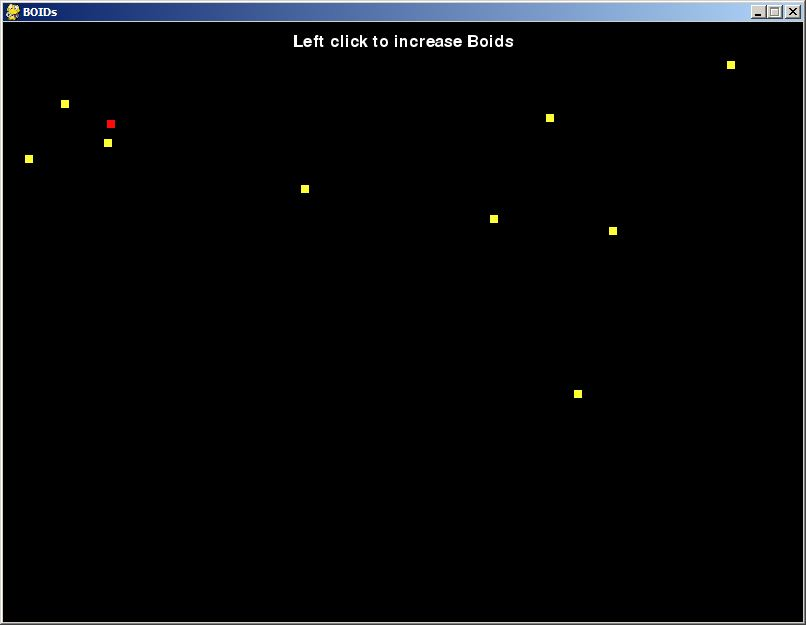
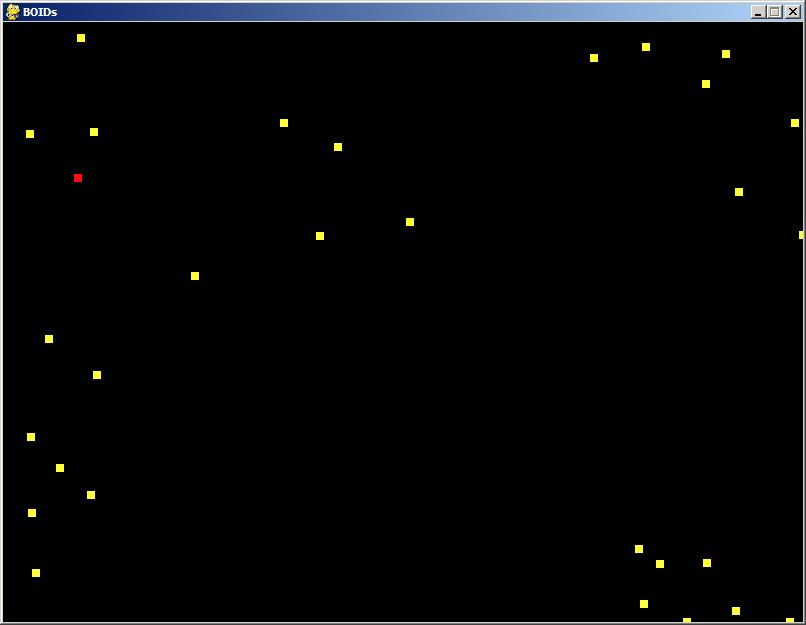

# boids_using_python
I tried creating boids in python3.6 using pygame module

Boids is an artificial life program, developed by Craig Reynolds in 1986, which simulates the flocking behaviour of birds.
You can read more about it [here](https://en.wikipedia.org/wiki/Boids)

Special thanks to [Sebastian Lague](https://github.com/SebLague), you should definitely check out [his youtube channel](https://youtube.com/c/SebastianLague)

# Preview

